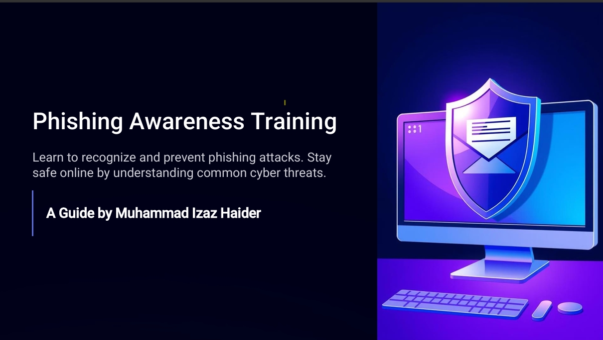

# 🛡️ Phishing Awareness Training

 

#### 📖 Learn to recognize and prevent phishing attacks. Stay safe online by understanding common cyber threats.  [`Watch on LinkedIn`](https://www.linkedin.com/posts/muhammad-izaz-haider-091639314_rhombixtechnologies-internship-cybersecurity-activity-7312025298789658624-5xZT)

🔹 **A Guide by Muhammad Izaz Haider**

## 📌 Overview

Phishing is one of the most **dangerous cyber threats** that targets users by tricking them into revealing personal information. This training module is designed to **help individuals of all ages** understand phishing attacks, identify warning signs, and adopt best security practices to stay protected.

📂 **This repository includes:**
- ✔️ A **detailed presentation** explaining phishing techniques
- ✔️ A **video walkthrough** of the training module
- ✔️ A **PDF version** for easy reference

## 🚨 What is Phishing?

Phishing is a **cyber deception technique** where criminals impersonate trusted entities—such as banks, retailers, or social media platforms—to steal sensitive information. These scams are often carried out through **emails, fake websites, or fraudulent messages.**

- 🔹 Example: You may receive an email appearing to be from your bank, requesting you to update your details. However, the link directs you to a **fake website** that collects your data.

## ⚠️ Why is Phishing Dangerous?

- 🔹 **Identity Theft:** Stolen personal details can be used to create fraudulent accounts.
- 🔹 **Financial Loss:** Attackers may gain access to **bank accounts and credit card details**.
- 🔹 **Malware Installation:** Phishing emails often contain links or attachments that install malware, ransomware, or spyware on your device.

## 🎭 Common Types of Phishing

- ✔️ **Email Phishing:** Fake emails impersonating legitimate organizations.
- ✔️ **Spear Phishing:** Targeted attacks on specific individuals.
- ✔️ **Smishing/Vishing:** Phishing through **SMS or phone calls**.
- ✔️ **Clone Phishing:** Duplicated emails with malicious links.

## 🕵️‍♂️ Recognizing a Phishing Email

- 📩 **Suspicious Sender Address:** Always verify email senders.
- ⚠️ **Urgent Language & Pressure Tactics:** Be cautious of emails creating a sense of urgency.
- 📝 **Grammar Errors:** Poorly written messages are red flags.
- 🔗 **Malicious Links:** Hover over links before clicking.

## 🌐 Phishing Website Red Flags

- 🚨 **Altered URLs:** Attackers slightly modify URLs to mimic real websites.
- 🔒 **No HTTPS:** Secure websites have a padlock icon; phishing sites often don’t.
- 💻 **Poor Design:** Fake sites may have spelling mistakes, low-quality graphics, and excessive pop-ups.

## 🔐 Protect Yourself from Phishing

- ✅ **Think Before Clicking:** Always double-check links and attachments.
- ✅ **Enable 2FA:** Use **two-factor authentication** for extra security.
- ✅ **Secure Your Devices:** Keep your system updated with the latest security patches.
- ✅ **Report Phishing Attempts:** Notify authorities or organizations if you receive a phishing email.

## 🎯 Final Tips for Staying Safe

- ✔️ **Verify Senders** – Never trust emails blindly.
- ✔️ **Think Before Clicking** – Be cautious of unknown links and attachments.
- ✔️ **Educate Others** – Share phishing awareness tips with friends and family.

🌍 **Online safety starts with awareness.** By staying alert and spreading knowledge, we can create a safer digital environment for everyone.

## 📂 Project Files

- 📌 **Presentation:** [`Phishing_Awareness_Training.pptx`](Phishing_Awareness_Training.pptx)
- 📌 **PDF Guide:** [`Phishing_Awareness_Training.pdf`](Phishing_Awareness_Training.pdf)
- 📌 **Video Explanation:** [`presentation.mp4`](presentation.mp4)
- 📌 **Watch on LinkedIn** [`Watch on LinkedIn`](https://www.linkedin.com/posts/muhammad-izaz-haider-091639314_rhombixtechnologies-internship-cybersecurity-activity-7312025298789658624-5xZT)

## 🏆 Internship Task Completion

- ✅ **Internship Provider:** Rhombix Technologies
- ✅ **Task Name:** Phishing Awareness Training
- ✅ **Task Completion Status:** ✅ Completed

🙌 **Stay safe online and keep learning!** 🚀
